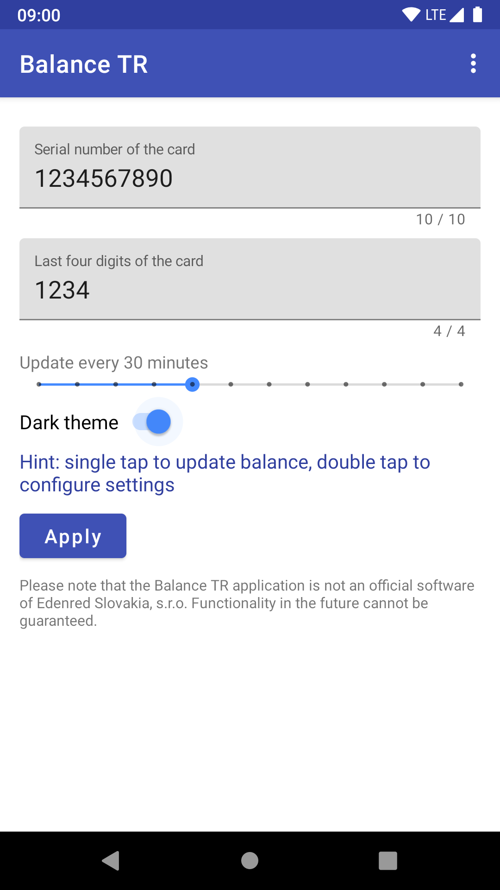

<h1>Balance Widget TR </h1>

Balance Widget TR is an open source application displaying the balance on Ticket Restaurant&#174; dietary tickets from Edenred Slovakia, s.r.o. The application displays the account balance in a simple widget.

Please note that the Balance Widget TR application is not an official software of Edenred Slovakia, s.r.o. Functionality in the future can not be guaranteed.

## Screenshots

## License
Balance Widget TR is licensed under the Apache License Version 2.0

[Apache License Version 2.0](https://www.apache.org/licenses/LICENSE-2.0)
